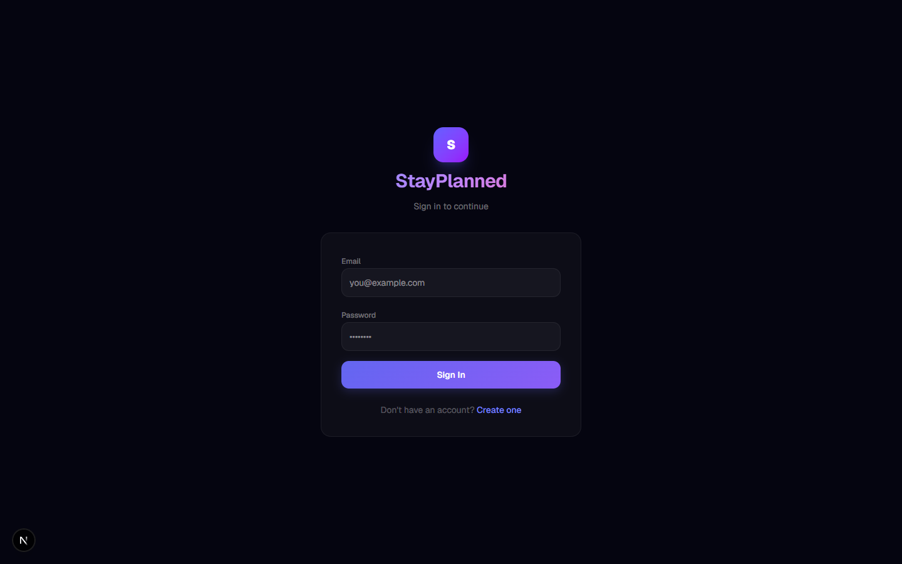
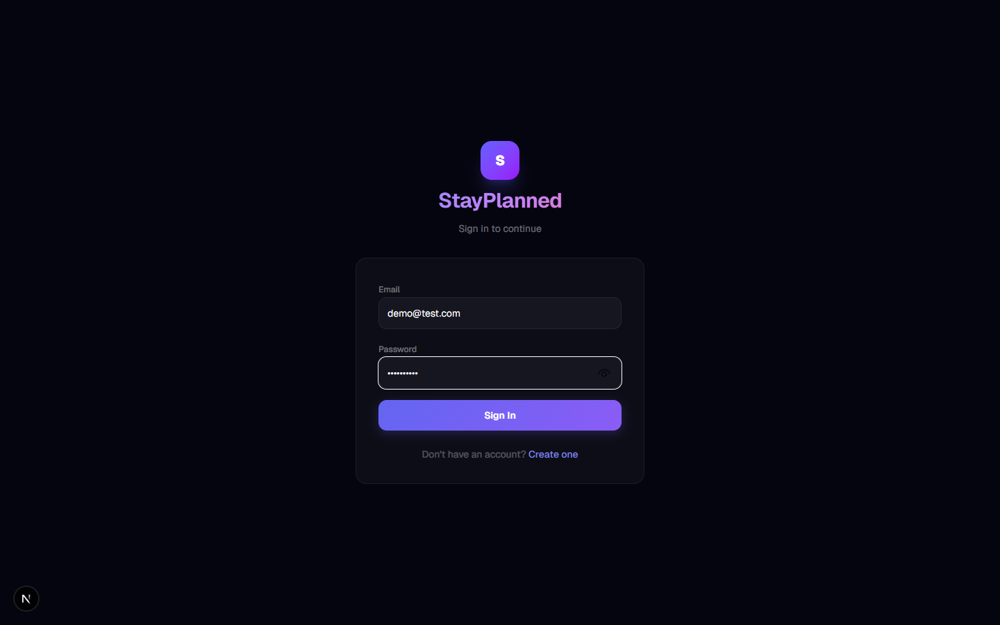
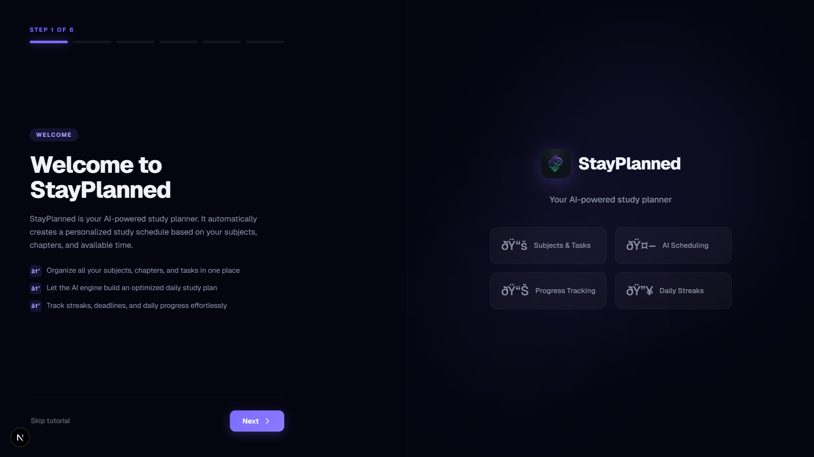
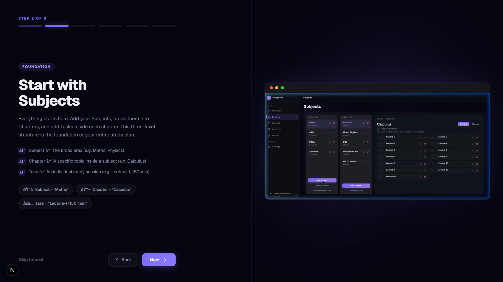
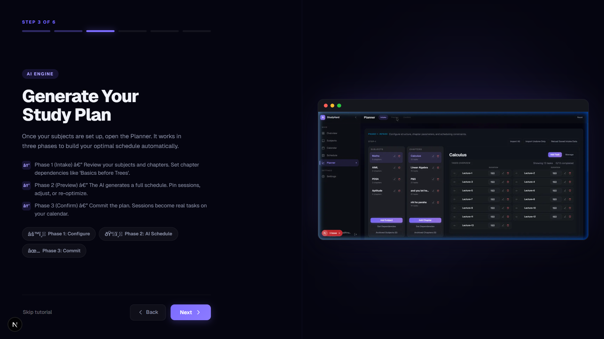
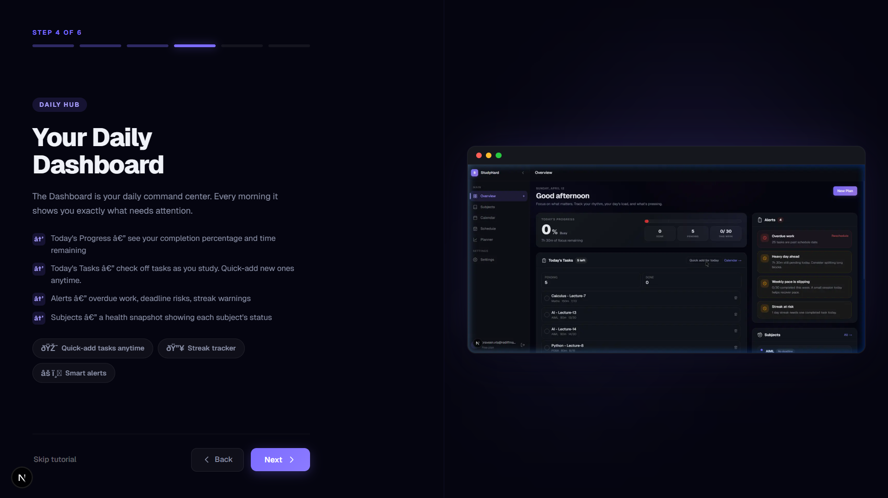
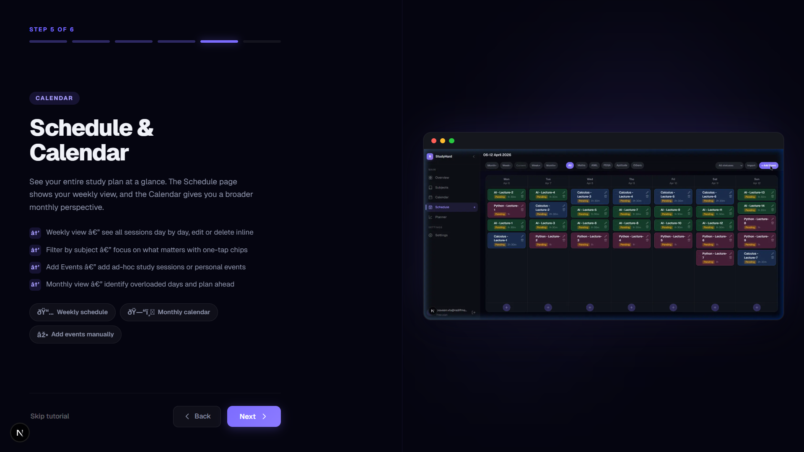
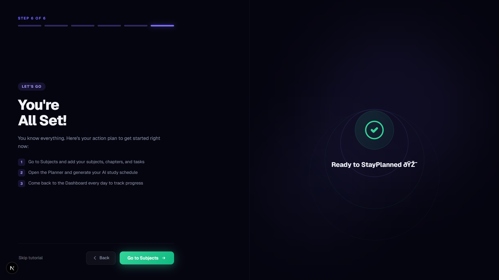
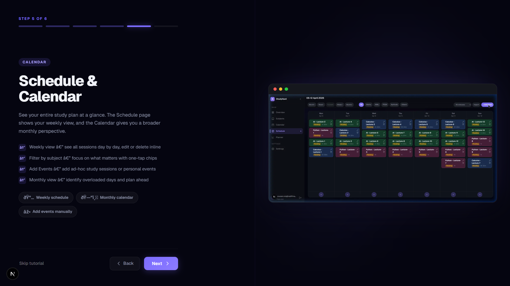

# Onboarding Page Crawl Documentation

Date: 2026-04-12
Base URL: http://localhost:3000
User ID used: demo@test.com

## What was done

1. Opened login page.
2. Filled provided credentials.
3. Clicked Sign In.
4. Opened onboarding route.
5. Clicked Next through all six onboarding steps.
6. Clicked Back once to validate reverse navigation.

## Onboarding page behavior observed

- The onboarding flow is a 6-step wizard.
- Each step updates the progress label (for example, "Step 3 of 6").
- Primary forward navigation uses a Next button.
- Reverse navigation is available with a Back button (hidden/disabled on step 1).
- Step 6 presents completion CTA state (Go to Subjects) and supports moving back.

## Click-by-click screenshot log

### 1) Opened login page
Action: Opened /auth/login

### 2) Filled credentials
Action: Filled credentials (email + password)

### 3) Opened onboarding step 1
Action: Opened /onboarding

### 4) Clicked Next to step 2
Action: Clicked Next

### 5) Clicked Next to step 3
Action: Clicked Next

### 6) Clicked Next to step 4
Action: Clicked Next

### 7) Clicked Next to step 5
Action: Clicked Next

### 8) Clicked Next to step 6
Action: Clicked Next

### 9) Clicked Back to step 5
Action: Clicked Back

## Generated files

- manifest.json (machine-readable capture metadata)
- onboarding-page-documentation.md (this report)
- 9 PNG screenshots listed above
